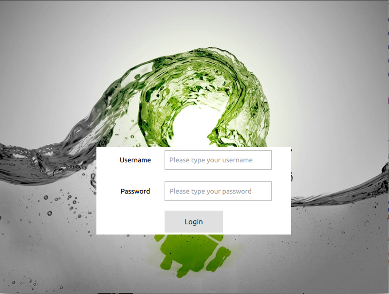
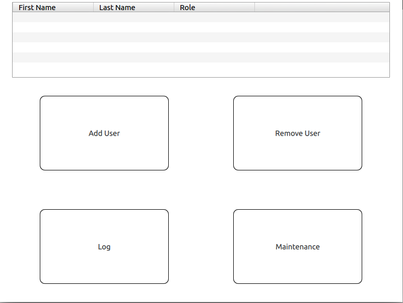
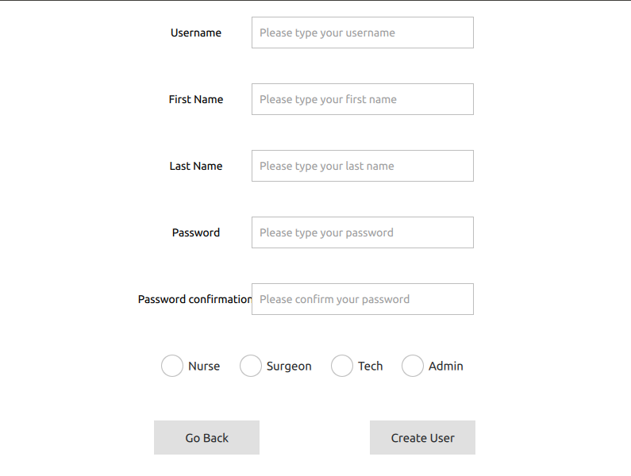

# qt-app-random

This is going to be my first Qt open source project for developing apps. It will serve as a basic framework to hook up with a qml frontend and c++ backend application which could be deployed using CMakeList accross different platforms.

## Build
You can clone the package and build with CMakelist in qtcreator. Currently the only dependencies is qt version should be greater than 5.12(I am using qt 5.13).

### First Stage
#### I will implement a basic login page which is similar to what I have done in my previous company. What will be different is there the login information will be saved into a database. 
Progress: 90%  
Expected delivery: 15-Jan-2020  
Currently Login Interface: 
Current progress: need to create the sql syntax for user creation in the database with qt/c++ apis

Now, it supports you to have a login credientials with  
username: admin  
password: admin  
And you will get into the admin page.

Click the add user button it will lead you to the add user page.

### Second Stage
#### I will add more front-end qml elements to make the app visually appealing

### Third Stage
#### I will implement some interesting features to work
